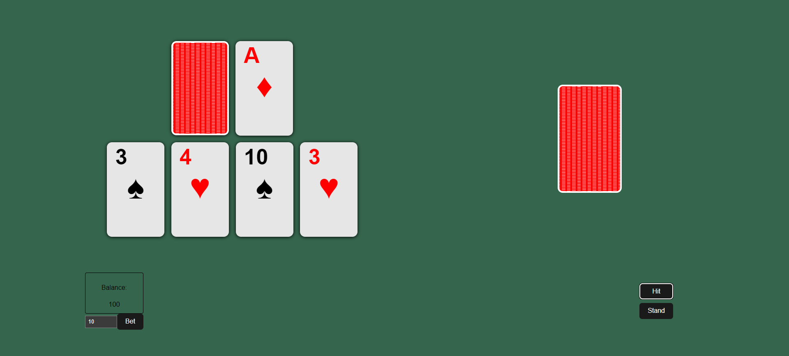

# Blackjack Game



This Blackjack application provides a Blackjack game experience. The application is built using React.js and ASP.NET Core, with a clear separation between the front-end and back-end components. It offers functionalities like placing bets, dealing cards, and checking for a winner, all in line with the traditional rules of Blackjack.

[Read more (written in Romanian)](Documentation/DocumentatieBlackjack.docx)

## Features

### Front-End

#### Landing Page

The entry point where users can start a new game or resume an existing one.

#### Game Page

This page allows players to:

- Place a bet (the amount must be between 10 and the available balance).
- Choose to "Hit" (request an additional card) or "Stand" (keep the current hand).
- The game dynamically updates to show the player's hand and the dealer's hand.

### Back-End

The back-end handles all game logic and provides multiple endpoints for interacting with the game:

- **`start-new-game`**: Initializes a new game, resetting the game state and preparing for a new round.

  - **Response**: Returns the game state, including the player's hand, dealer's hand, and player details.

- **`bet`**: Allows the player to place a bet for the current round.

  - **Response**: Text message indicating whether the bet was successfully placed.

- **`deal-cards`**: Deals cards to both the player and the dealer for the current round.

  - **Response**: Returns the game state, including the updated hands of the player and dealer, as well as the player details.

- **`hit`**: Allows the player to request an additional card.

  - **Response**: Returns the game state with the player's updated hand.

- **`stand`**: Ends the player's turn and allows the dealer to play according to the game rules.

  - **Response**: Returns the game state with both the player's and dealer's final hands.

- **`check-winner`**: Determines the winner of the round after both the player and dealer have completed their turns.
  - **Response**: Text message indicating the outcome of the game: "Player wins," "Dealer wins," or "Tie."

## How to Use

### Prerequisites

- **Node.js**: Ensure that you have a version of Node.js installed on your machine. Used version 20.16.0 for this project.

- **.NET 8.0**: Ensure that .NET 8.0 SDK is installed on your machine.

### Running the Application

1. **Clone the Repository**: Clone the project from the GitHub repository.

   ```bash
   git clone https://github.com/tbtiberiu/Blackjack.git
   cd Blackjack
   ```

2. **Open the Project**: Open the `Blackjack.sln` inside Visual Studio.

3. **Run the Application**: Start the application using the `F5` (Debugging mode) or `CTRL` + `F5`.

4. **Access the Game**: Open your browser and navigate to `https://localhost:5173` to start playing Blackjack. You can also see the Swagger UI page at `https://localhost:7147/swagger/index.html`.

### API Endpoints

#### Start a New Game:

- **POST** `/api/game/start-new-game`
- **Response**: JSON object representing the game state.

#### Place a Bet:

- **POST** `/api/game/bet`
- **Body**: `{ "amount": 50 }`
- **Response**: Text message indicating success or failure.

#### Deal Cards:

- **POST** `/api/game/deal-cards`
- **Response**: JSON object with the updated hands for player and dealer.

#### Hit:

- **POST** `/api/game/hit`
- **Response**: JSON object with the player's updated hand.

#### Stand:

- **POST** `/api/game/stand`
- **Response**: JSON object with the final game state.

#### Check Winner:

- **GET** `/api/game/check-winner`
- **Response**: Text message indicating the game result.

## Design Patterns Used

### Singleton with Double Locking

- **Purpose**: Ensures that there is only one instance of the `BlackjackGame` class throughout the application, providing global access to this instance.
- **Implementation**: The `Singleton` pattern with double locking ensures thread safety and efficient access during game execution.

### Factory Design Pattern

- **Purpose**: Centralizes the creation of `Card` and `Deck` objects.
- **Implementation**: The `Factory` pattern allows for easy management and extension of card and deck creation, providing a flexible structure that can be expanded to include additional card types or decks in the future.

### State Design Pattern

- **Purpose**: Manages the transitions between different game phases such as `BettingPhase`, `PlayerTurn`, `DealerTurn`, and `GameOver`.
- **Implementation**: The `State` pattern enables the game to change its behavior dynamically based on its current state, making the game flow more manageable and scalable.

## Testing

The project includes comprehensive unit and integration tests to ensure the correctness and reliability of the application. The tests are organized into several categories:

- **CardTests**: Verifies the behavior and correct functioning of the `Card` class.
- **DealerHandTests**: Tests how the dealer's hand is managed during the game.
- **DeckTests**: Validates the creation and management of card decks.
- **PlayerHandTests**: Ensures that the player's hand is correctly managed, including adding cards and evaluating the hand's value.
- **PlayerTests**: Evaluates the correct setting of player attributes and their interaction with the game logic.

To run the tests, use the following command:

```bash
dotnet test
```

Test results are stored in the `TestResults` directory and can be reviewed to diagnose and fix any issues.

## Diagrams

_(Can be found [here (Romanian)](Documentation/DocumentatieBlackjack.docx))_

The project includes several UML diagrams to illustrate the system's design and architecture:

- **Use Case Diagram**: Depicts the interactions between users (players and dealer) and the game system.
- **Class Diagram**: Shows the static structure of the application, including classes, attributes, methods, and relationships.
- **State Diagram**: Illustrates the different states of the game and transitions between them.
- **Activity Diagram**: Provides an overview of the game's workflow and the actions taken during each round.
- **Sequence Diagram**: Represents the order of interactions between objects during gameplay.
- **Collaboration Diagram**: Visualizes the communication and relationships between objects in the game.

These diagrams help in understanding the system's architecture and are useful for both developers and stakeholders.

## Conclusion

This Blackjack application is a robust and scalable solution for online Blackjack gameplay, with a well-structured codebase adhering to key design patterns.
